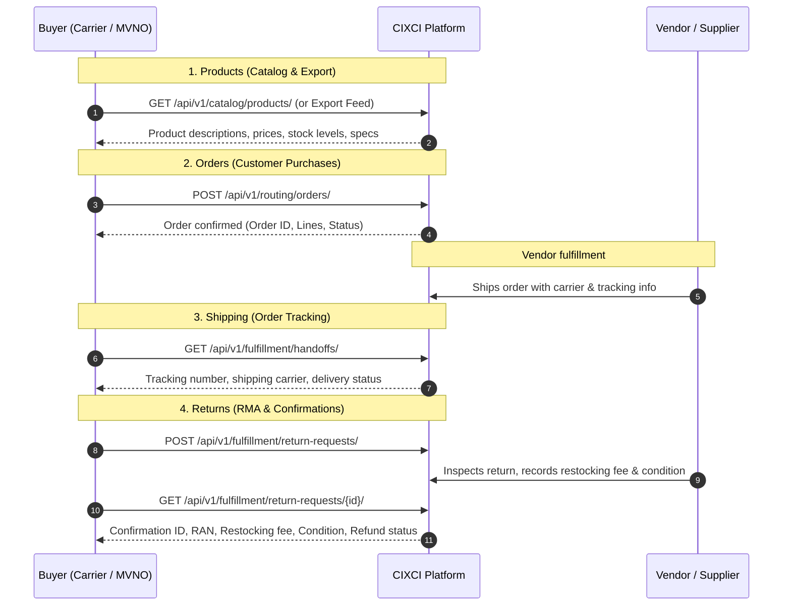

# CIXCI Buyer Data Integration Specification & API Guide

## Document Description
This document serves as the official integration guide for Buyers (Carriers, MVNOs, and Retail Partners) regarding key data fields related to **Products**, **Orders**, **Shipping**, and **Returns** that CIXCI provides access to via our REST APIs.

---

## Interactive API Documentation Links
The CIXCI platform exposes dedicated interactive documentation interfaces containing **only** the endpoints required for Buyer integration:

- **Swagger UI (Interactive API Explorer)**: [`/api/buyer-docs/`](http://localhost:8000/api/buyer-docs/)
- **ReDoc (Technical Reference)**: [`/api/buyer-redoc/`](http://localhost:8000/api/buyer-redoc/)
- **OpenAPI 3.0 Schema (JSON / YAML)**: [`/api/buyer-schema/`](http://localhost:8000/api/buyer-schema/)

---

## Authentication & Headers
All requests must be authenticated using either an API Key or a JWT Bearer Token scoped to the Buyer company tenant.

```http
Authorization: Bearer <your_jwt_token>
```
*or*
```http
X-API-Key: <your_company_api_key>
Content-Type: application/json
Accept: application/json
```

---

## Data Flow Overview & Endpoints



---

## 1. Products: CIXCI Sends Selected Product Data to Buyer

### Purpose
CIXCI provides detailed information about selected products to buyers. This data includes product descriptions, pricing, and availability, enabling carriers to offer these products to their customers.

### Data Fields Sent
- **Core Identifiers**: `id`, `sku`, `upc`, `name`
- **Pricing**: `msrp`, `buyer_wholesale_price`, `sale_price`, `map_price`
- **Availability & Status**: `status`, `inventory_level`, `launch_date`
- **Descriptions & Media**: `short_description`, `description`, `primary_image_url`, `image_urls`
- **Physical Specifications**: `length`, `width`, `height`, `weight`
- **Color & Compatibility**: `vendor_color`, `system_color`, `device_compatibility`
- **Warranty & Marketing**: `brand_warranty`, `meta_title`, `meta_description`, `promotional_information`
- **Vendor Return Address**: `vendor_return_address1`, `vendor_return_address2`, `vendor_return_city`, `vendor_return_state`, `vendor_return_zip_code` (sent once per vendor per export)

### Endpoints

#### `GET /api/v1/catalog/products/`
List all accessory products available in the buyer's scoped catalog.
- **Query Parameters**:
  - `page`: Page number (integer)
  - `page_size`: Number of records per page (default 20, max 100)
  - `search`: Search query across product name, SKU, UPC
  - `brand`: Filter by brand name
  - `product_category`: Filter by category (e.g., `Cases`, `Chargers`, `Screen Protectors`)
  - `compatibility_status`: Filter by device compatibility status (`complete`, `in_progress`)

#### `GET /api/v1/catalog/products/{id}/`
Retrieve full product specifications and compatibility for a specific product ID.

#### `POST /api/v1/catalog/export-jobs/create_job/`
Request an asynchronous product catalog export feed (JSON, CSV, XLSX) containing all 31 spec fields.
- **Request Body**:
```json
{
  "format": "json"
}
```

#### `GET /api/v1/catalog/export-jobs/list_jobs/`
List previous product export jobs and their status.

#### `GET /api/v1/catalog/export-jobs/{id}/`
Get the current status of an export job (`pending`, `processing`, `completed`, `failed`).

#### `GET /api/v1/catalog/export-jobs/{id}/download/`
Download the generated export data file.

---

## 2. Orders: CIXCI Receives Order Information from Buyer

### Purpose
CIXCI pulls in / receives detailed order information from buyers. This includes data on customer purchases made through buyer platforms.

### Data Fields Received
- **Order Identifiers**: `buyer_order_number`, `order_reference`
- **Customer Details**: First name, last name, phone number, email
- **Shipping Destination**: Address line 1, address line 2, city, state, postal code, country
- **Product Lines**: Product ID, SKU, UPC, ordered quantity, unit price
- **Financial Totals**: Total cost, tax, shipping amount, currency
- **Timestamps**: Order transaction date and time

### Endpoints

#### `POST /api/v1/routing/orders/`
Submit a customer purchase order from the buyer platform into CIXCI for routing and vendor fulfillment.
- **Request Body**:
```json
{
  "buyer_order_number": "MVNO-ORD-2026-90412",
  "placed_at": "2026-09-11T14:30:00Z",
  "customer_first_name": "Jane",
  "customer_last_name": "Doe",
  "customer_email": "jane.doe@example.com",
  "customer_phone": "+1-555-0199",
  "shipping_address_line1": "742 Evergreen Terrace",
  "shipping_address_line2": "Apt 4B",
  "shipping_city": "Springfield",
  "shipping_state": "IL",
  "shipping_postal_code": "62704",
  "shipping_country": "US",
  "total_amount": "59.98",
  "currency": "USD",
  "order_lines": [
    {
      "product_id": "7f8b9c2a-3d4e-5f6a-7b8c-9d0e1f2a3b4c",
      "sku": "CASE-IP16-CLR",
      "upc": "810012345678",
      "quantity": 2,
      "unit_price": "29.99"
    }
  ]
}
```

#### `GET /api/v1/routing/orders/`
List all orders submitted by the buyer, filterable by date, status, or search query.

#### `GET /api/v1/routing/orders/{id}/`
Retrieve status, lines, and tracking linkage for a specific order.

---

## 3. Shipping: CIXCI Sends Shipping Information to Buyer

### Purpose
Once an order has been shipped by the vendor, CIXCI provides buyers with tracking and fulfillment details.

### Data Fields Sent
- **Order Linkage**: `buyer_order_number`, `buyer_id`, `vendor_order_number`
- **Carrier & Tracking**: `shipping_carrier` (FedEx, UPS, USPS, DHL, etc.), `tracking_number`
- **Fulfillment Status**: `order_status` (`Processing`, `Shipped`, `Delivered`, `Exception`, `Closed`)
- **Key Dates**: `shipped_date`, `delivered_date`

### Endpoints

#### `GET /api/v1/fulfillment/handoffs/`
List shipping details and tracking information for all fulfilled orders belonging to the buyer.
- **Response**:
```json
[
  {
    "id": "c3d4e5f6-a7b8-9012-cdef-1234567890ab",
    "buyer_order_number": "MVNO-ORD-2026-90412",
    "buyer_id": "8a7b6c5d-4e3f-2a1b-0c9d-8e7f6a5b4c3d",
    "vendor_order_number": "VND-CONF-98765",
    "shipping_carrier": "FedEx",
    "tracking_number": "794689234123",
    "order_status": "Shipped",
    "shipped_date": "2026-09-11",
    "delivered_date": null,
    "created_at": "2026-09-11T16:00:00Z"
  }
]
```

#### `GET /api/v1/fulfillment/handoffs/{id}/`
Retrieve specific shipment tracking and carrier details.

---

## 4. Returns: Return Information & Confirmations

### Purpose
CIXCI handles returns initiated by customers through the buyer's platform. Once a returned product is received and inspected by the vendor, CIXCI sends return confirmation details to the buyer.

### Data Fields Sent / Received
- **Confirmation ID**: Return Confirmation ID (`confirmation_id` / UUID)
- **RAN**: Return Authorization Number (`ran`)
- **Order Reference**: Suborder Number (`suborder_reference`), `buyer_order_number`
- **Product Details**: `sku`, `upc`, `return_quantity`
- **Reason**: Customer return reason
- **Restocking Fee**: Fee deducted from refund (`restocking_fee`)
- **Item Condition**: Physical condition upon vendor inspection (`unopened`, `like_new`, `used`, `damaged`, `defective`, `other`)
- **Refund Status**: Current refund stage (`pending`, `processed`, `rejected`, `partial`)
- **Vendor Return Address**: Structured vendor return address for physical return shipment

### Endpoints

#### `POST /api/v1/fulfillment/return-requests/`
Initiate a customer return request.
- **Request Body**:
```json
{
  "suborder_reference": "9a8b7c6d-5e4f-3a2b-1c0d-9e8f7a6b5c4d",
  "sku": "CASE-IP16-CLR",
  "upc": "810012345678",
  "return_quantity": 1,
  "reason": "Customer ordered incorrect size"
}
```

#### `GET /api/v1/fulfillment/return-requests/`
List all return requests and inspect confirmations from vendors.
- **Response**:
```json
[
  {
    "id": "e5f6a7b8-9012-3456-cdef-7890abcdef12",
    "confirmation_id": "e5f6a7b8-9012-3456-cdef-7890abcdef12",
    "ran": "RAN-20260911-5821",
    "buyer_order_number": "MVNO-ORD-2026-90412",
    "suborder_reference": "9a8b7c6d-5e4f-3a2b-1c0d-9e8f7a6b5c4d",
    "sku": "CASE-IP16-CLR",
    "upc": "810012345678",
    "return_quantity": 1,
    "reason": "Customer ordered incorrect size",
    "status": "return_received",
    "restocking_fee": "5.0000",
    "item_condition": "like_new",
    "refund_status": "processed",
    "return_received_date": "2026-09-14T10:15:00Z"
  }
]
```

#### `GET /api/v1/fulfillment/return-requests/{id}/`
Retrieve specific return confirmation details and inspection outcome.

---

## Summary of Buyer Endpoints

| Category | HTTP Method | Path | Purpose |
|:---|:---|:---|:---|
| **1. Products** | `GET` | `/api/v1/catalog/products/` | List accessory products, stock levels, and prices |
| **1. Products** | `GET` | `/api/v1/catalog/products/{id}/` | Get single product detail and compatibility |
| **1. Products** | `POST` | `/api/v1/catalog/export-jobs/create_job/` | Trigger product catalog export feed |
| **1. Products** | `GET` | `/api/v1/catalog/export-jobs/list_jobs/` | List catalog export feeds |
| **1. Products** | `GET` | `/api/v1/catalog/export-jobs/{id}/` | Check export feed generation status |
| **1. Products** | `GET` | `/api/v1/catalog/export-jobs/{id}/download/` | Download exported product catalog file |
| **2. Orders** | `POST` | `/api/v1/routing/orders/` | Submit customer purchase order to CIXCI |
| **2. Orders** | `GET` | `/api/v1/routing/orders/` | List buyer purchase orders |
| **2. Orders** | `GET` | `/api/v1/routing/orders/{id}/` | Get order details and current processing status |
| **3. Shipping** | `GET` | `/api/v1/fulfillment/handoffs/` | List order tracking, carrier, and delivery status |
| **3. Shipping** | `GET` | `/api/v1/fulfillment/handoffs/{id}/` | Get specific shipment tracking details |
| **4. Returns** | `POST` | `/api/v1/fulfillment/return-requests/` | Submit customer return request |
| **4. Returns** | `GET` | `/api/v1/fulfillment/return-requests/` | List returns with inspection & refund confirmation |
| **4. Returns** | `GET` | `/api/v1/fulfillment/return-requests/{id}/` | Get return confirmation details |
